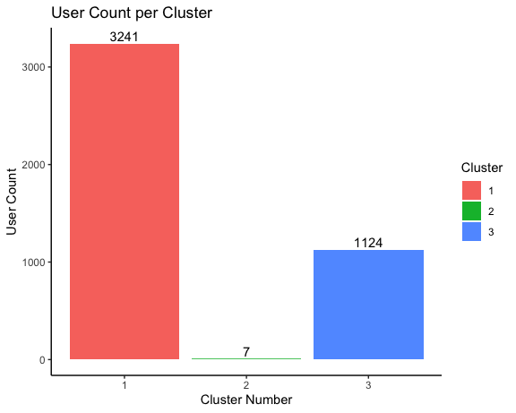
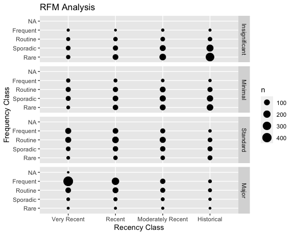

# Customer Segmentation Analysis

## Project Overview
This project involves analyzing a retail dataset to perform customer segmentation using RFM (Recency, Frequency, Monetary Value) analysis. The objective is to classify customers based on their purchase patterns and ultimately visualize and cluster these segments to drive more focused marketing strategies.

## Dataset
The dataset used in this project is the `Online_Retail` dataset, which contains transaction records of a global online retail company.

## Features
The analysis includes:
- Cleaning data and handling missing values.
- Computing RFM metrics to understand customer buying habits.
- Segmenting customers based on computed RFM scores.
- Clustering customers into distinct groups using K-means clustering.
- Visualizing the results of RFM analysis and clustering.

## Visualizations
The project generates several visual outputs that help in understanding the customer segmentation more vividly. Below are the descriptions and examples of these visualizations:

### User Count per Cluster
This bar chart shows the distribution of users across the three clusters determined by the K-means clustering algorithm. Each cluster represents a group of customers with similar RFM characteristics.



- **Cluster 1 (Red Bar):** Contains the largest group of customers with 3,241 users, suggesting a common pattern in their purchasing behavior that distinguishes them from other clusters.
- **Cluster 2 (Green Bar):** This cluster has the smallest group with only 7 users, indicating very distinct or niche behavior patterns compared to the broader customer base.
- **Cluster 3 (Blue Bar):** Comprises 1,124 users, representing another significant segment of the customer base.

This visualization helps in quickly identifying how many users fall into each segment, facilitating targeted marketing strategies for each distinct cluster.

The insights drawn from the RFM analysis and subsequent clustering can be used to tailor marketing efforts. For example, customers in Cluster 1 might respond better to frequent engagement and promotions, while those in Cluster 2, being fewer, might require more personalized and high-value approaches.

### RFM Analysis Visualization
This plot, the RFM Analysis, provides a detailed view of customer segments based on Recency, Frequency, and Monetary classes. It employs a matrix format to show the concentration of customers across different segments, represented by the size of dots, which correlates to the number of customers in each segment.



- **X-axis (Recency Class):** Categorizes customers based on the recency of their last purchase with labels from 'Very Recent' to 'Historical'.
- **Y-axis (Frequency Class):** Ranges from 'Rare' to 'Frequent', indicating how often these customers purchase.
- **Grid Panels (Monetary Class):** Each panel represents a monetary category from 'Insignificant' to 'Major', showing the spending level of customers.
- **Dot Size:** Indicates the number of customers in each segment, providing a visual scale of 100 to 400 customers.

This visualization helps in identifying not only how recent and frequent customers are purchasing but also how much they are spending. It facilitates tailored marketing strategies for each segment, focusing on their specific characteristics and buying behavior.

## Installation
To run this project, you will need R and several packages that can be installed using the following R commands:
```r
install.packages("ggplot2")
install.packages("gplots")
install.packages("cluster")
install.packages("dplyr")
install.packages("e1071")
install.packages("tidyr")
install.packages("data.table")
install.packages("lubridate")
install.packages("rfm")
